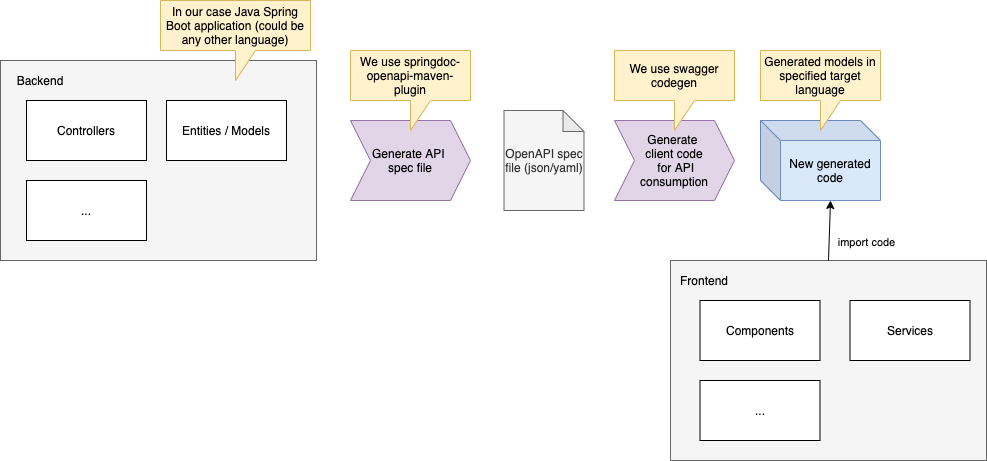

# Pizza Time!


*Exploring state-of-the-art state management and testing practices for ReactJS in 2022*

This project was bootstrapped with [Create React App](https://github.com/facebook/create-react-app) using the TypeScript template.

## Pre-requisites

- Only tested on a mac development machine (some scripts might need adaption to work on windows)
- `Node` and npm LTS must be installed on dev machine
- `Docker` must be installed on dev machine

## Available scripts

```shell
# Generate client code for order-service API (required for frontend):
./openapi-codegen.sh

# Install dependencies:
npm install

# Run in development mode (on port 3000):
npm start

# Run unit and integration tests: 
npm test

# Run e2e tests:
npm run cypress:open
```

## Topics covered in this project

- CRA using TypeScript template
- Routing using react-router-dom and BrowserRouter
- State management using Redux Toolkit
- Redux middleware using Thunk (default from Redux Toolkit)
- Fetching data using RTK Query
- React error boundary
- Form validation using Formik
- Unit and integration testing including a real store using react-testing-library and msw for mocking network requests
- E2e testing using cypress (stubbed network calls)
- Client code generation based on OpenAPI specification

## Links and relevant documentation
- [Redux Toolkit TypeScript quick start](https://redux-toolkit.js.org/tutorials/typescript)
- [Official CRA template project using redux toolkit and typescript](https://github.com/reduxjs/cra-template-redux-typescript)
- [Redux async logic](https://redux.js.org/tutorials/essentials/part-5-async-logic)
- [Guidelines for writing tests for Redux](https://redux.js.org/usage/writing-tests)
- [Redux Toolkit Query Overview](https://redux-toolkit.js.org/rtk-query/overview)

---

## Code Generation

This project uses Swagger CodeGen and OpenAPI to generate parts of the consumer code for the order service API.



### Prerequisites
- The provided script expects you to have `docker` installed on your machine to be able to execute the code generation

### Generating Client Code

```shell
# Generate the TypeScript client code:
./openapi-codegen.sh
# This will create a folder `generated` containing the generated client code
```

### Open Points

- Where to place the generated code ideally?
- How to split the generated APIs into separate files (e.g. by controller)?
- Currently only consuming generated models (interfaces) -> check what else can be used from the generated code
- Differences to [OpenAPI Tools / openapi-generator](https://github.com/OpenAPITools/openapi-generator)?

### Links and Documentation

- [Swagger CodeGen Github Repo](https://github.com/swagger-api/swagger-codegen)
- [Swagger Editor - Online](https://editor.swagger.io/)
- [Swagger Pet Store Github Repo (reference implementation)](https://github.com/swagger-api/swagger-petstore)
- [npm package that wraps Swagger CodeGen](https://www.npmjs.com/package/@openapitools/openapi-generator-cli)

---

## Test Strategy

This application defines the following test boundaries: 

Frontend: 
- Unit and integration tests that cover the collaboration of one or more components in collaboration with Redux (including middleware). Mocking happens on the network layer.
- E2e tests using Cypress. These tests cover the frontend e2e and run against a fully running frontend. Network requests are intercepted and stubbed.

Backend:
- Tbd

E2e environment tests: 
- These tests run against a target environment (e.g. test environment) and cover the integration of front- and backend.
- They should run automatically prior to a release.
